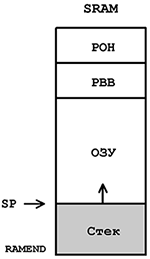
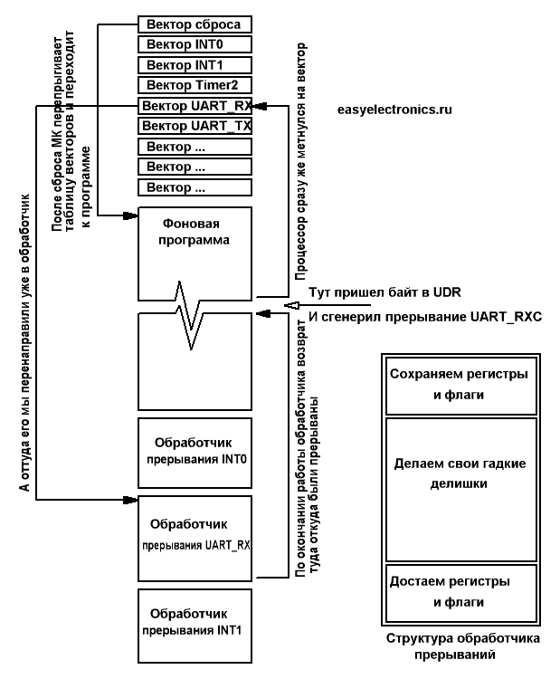
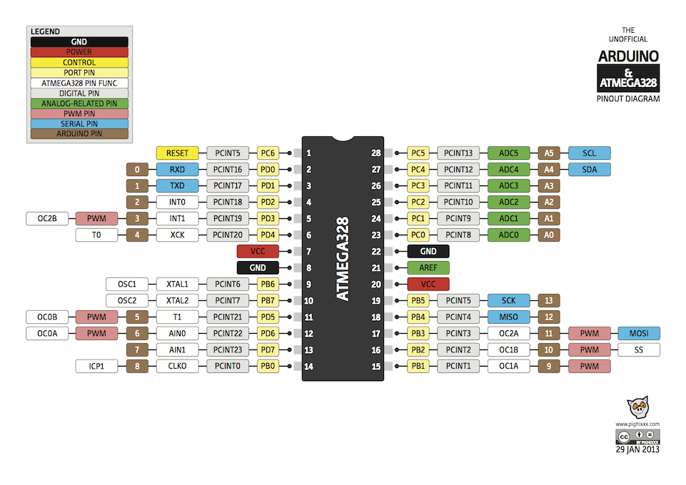

# Прерывания контроллеров семейства Atmel AVR
## Волков Егор Алексеевич
https://github.com/gole00201/mius


---
# Стек

Когда процессор встречает одну из инструкций вызова, то адрес следующего за ними слова копируется в стек. В момент выхода по команде ret адрес возврата восстанавливается из стека.
```c
#include <avr/io.h>
#include <util/delay.h>
void blink(){
    DDRB |= 1 << 5;
    PORTB |= 1 << 5;
    _delay_ms(1000);
    PORTB &= ~(1 << 5);
}
int main(void){
    blink();
}
```


---
# Как тогда реагировать на внезапные события?


---


# Обработчик прерывания
Когда приходит прерывание то контроллер завершит текущую команду (машинную инструкцию!) сразу же кинется выполнять процедуру обработки прерывания, а как выполнит, то вернется к прерваной фоновой программе.

---
# Вектор прерывания
## Куда прыгать то?
Как процессор узнает куда ему перепрыгивать? А по вектору!

Вектор это адрес перехода. У каждого аппаратного события имеющего прерывание есть свой вектор. Аппаратных событий у AVR тьма, поэтому таблица прерываний весьма толстая, десятки адресов.

```c
/* Interrupt vectors */
/* Vector 0 is the reset vector. */
/* External Interrupt Request 0 */
#define INT0_vect			_VECTOR(1)
#define SIG_INTERRUPT0			_VECTOR(1)
/* External Interrupt Request 1 */
#define INT1_vect			_VECTOR(2)
#define SIG_INTERRUPT1			_VECTOR(2)
```
---

# Какие регистры рулят всем этим процессом?

## GIMSK
Разрешает или запрещает внешние прерывания по входу INT0/INT1
```
бит 7 - INT1;
бит 6 - INT2;
```
Если разряд INT1/INT0 установлен в лог. 1, то внешнее прерывание по входу INT1/INT0 будет разрешено до тех пор, пока установлен в лог. 1 разряд I в регистре состояния SREG.


---
## SREG
Разрешение глобального прерывания.
```
бит 7 - I;
```
Бит разрешения глобального прерывания для разрешения прерывания должен быть установлен в состояние 1. Управление разрешением конкретного прерывания выполняется регистрами маски прерывания GIMSK и TIMSK. Если бит глобального прерывания очищен (в состоянии 0), то ни одно из разрешений конкретных прерываний, установленных в регистрах GIMSK и TIMSK, не действует. Бит I аппаратно очищается после прерывания и устанавливается для последующего разрешения глобального прерывания командой RETI.

---

## MCUCR (mcu Control Register)

Регистр MCUCR содержит биты управления режимами пониженного энергопотребления MCU и распознаванием сигналов внешних прерываний INT1 и INT0:
```
бит 7 — SM2 (Sleep Mode bit 2);
бит 6 — SE (Sleep Enable);
бит 5 — SM1 (Sleep Mode bit 1);
бит 4 — SM0 (Sleep Mode bit 0);
бит 3 — ISC11 (Interrupt Sense Control 1 bit 1);
бит 2 — ISC10 (Interrupt Sense Control 1 bit 0);
бит 1 — ISC01 (Interrupt Sense Control 0 bit 1);
бит 0 — ISC00 (Interrupt Sense Control 0 bit 0).
```

---

# Прерывания в avr-libc
## Что писать то?

```c
ISR(SIG_INTERRUPT1){ // Что делать в солучае прерывания SIG_INTERRUPT
    /*Делам что-то*/
}
```
## Но перед этим необходимо это прерывание разрешить!
```c
    sei();  // Все прерывания можно
    GIMSK |= (1<<INT1);  // разрешает или запрещает внешние прерывания по входу INT0/INT1

```

---


